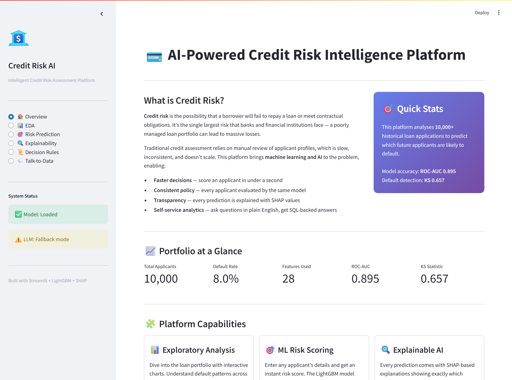
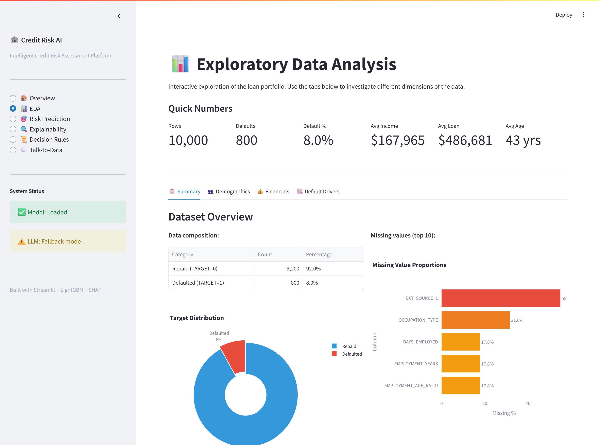
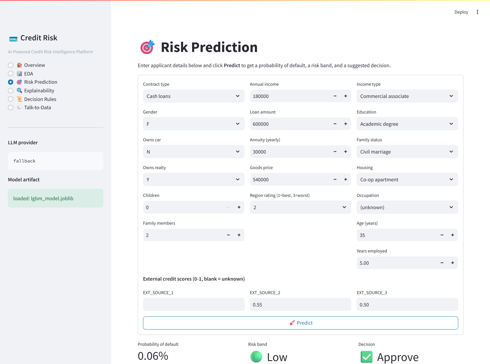
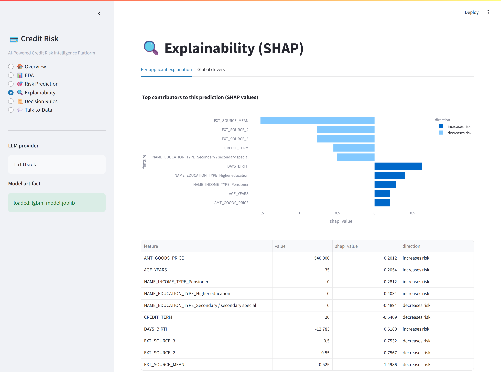
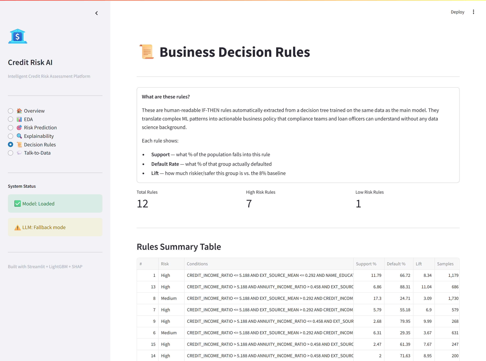
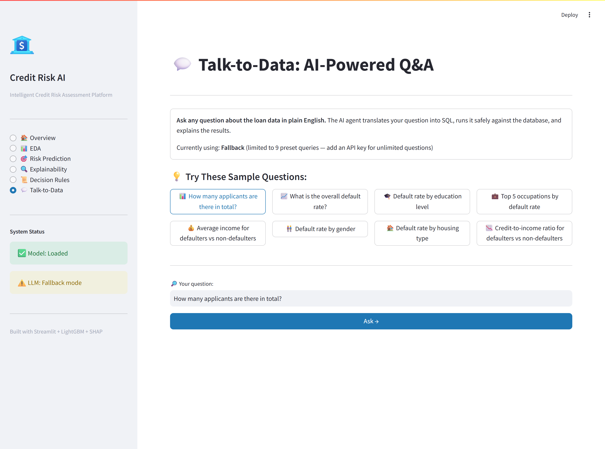

# 💳 AI-Powered Credit Risk Intelligence Platform

> Submission for the **NeoStats AI Engineer** assignment.
> An end-to-end credit-risk platform that combines **machine learning,
> explainable AI, decision rules, and a natural-language SQL agent** behind
> a single Streamlit UI, fully containerised with Docker.

<p align="center">
  
</p>

---

## 📑 Table of contents

1. [What this project does](#-what-this-project-does)
2. [Quick demo (1 picture per feature)](#-quick-demo-1-picture-per-feature)
3. [How it works (data flow walkthrough)](#-how-it-works-data-flow-walkthrough)
4. [Architecture diagram](#-architecture-diagram)
5. [Run it on macOS — step by step](#-run-it-on-macos--step-by-step)
6. [Run it on Windows / Linux](#-run-it-on-windows--linux)
7. [Repository layout](#-repository-layout)
8. [Environment variables](#-environment-variables)
9. [The dataset (and why a 10k synthetic sample ships in the repo)](#-the-dataset-and-why-a-10k-synthetic-sample-ships-in-the-repo)
10. [Model details and evaluation results](#-model-details-and-evaluation-results)
11. [Talk-to-Data: prompt engineering & hallucination control](#-talk-to-data-prompt-engineering--hallucination-control)
12. [Decision-rule derivation](#-decision-rule-derivation)
13. [Five EDA insights](#-five-eda-insights)
14. [Design decisions](#-design-decisions)
15. [Troubleshooting](#-troubleshooting)
16. [Limitations & next steps](#-limitations--next-steps)

---

## 🌟 What this project does

A bank credit officer needs five things from a credit-risk platform. This
project provides all five in one place:

| # | What an officer needs | What this app provides |
|---|---|---|
| 1 | Understand the loan portfolio | **EDA dashboard** with default rates by demographic, financial, and credit-history dimensions. |
| 2 | Score a new applicant fast | **ML model** that returns a probability of default + Low/Medium/High risk band + Approve/Review/Reject decision. |
| 3 | Justify the score (audit / regulator) | **SHAP explainability** — exact feature contributions per applicant + global driver chart. |
| 4 | Codify the model into a written policy | **Decision-rule extractor** — IF-THEN rules with support, default rate, and lift. |
| 5 | Ad-hoc questions on the portfolio without SQL | **Talk-to-Data chatbot** — plain English ⟶ safe SQLite SELECT ⟶ business-readable answer. |

Everything is wired into a single Streamlit web app and packaged into a
Docker image so a reviewer can run it with **one command**.

---

## 🖼 Quick demo (1 picture per feature)

| Section | Screenshot |
|---|---|
| Overview / KPIs |  |
| Exploratory Data Analysis |  |
| Risk Prediction (form + result) |  |
| Explainability (SHAP) |  |
| Decision Rules |  |
| Talk-to-Data Chatbot |  |

---

## 🔄 How it works (data flow walkthrough)

Read this once and the whole codebase will make sense.

### 1. Data ingestion (`src/data/`)

```
data/raw/application_train.csv   ← real Kaggle file (drop it in if you have it)
            │  if missing, fall back to ↓
data/sample/application_train_sample.csv   ← synthetic 10 k rows (committed)
            │
            ▼  (src/data/loader.py)
data/processed/credit_risk.db   ← SQLite, single source of truth
            │
            ▼
table `applications`  (23 columns, indexed on TARGET and NAME_CONTRACT_TYPE)
```

The first run creates the DB; subsequent runs reuse it (idempotent).

### 2. ML training (`src/ml/train.py`)

```
SQLite ──► load_dataframe()
             │
             ▼  add_engineered_features()  (age, ratios, EXT_SOURCE_MEAN, etc.)
             │
             ▼  build_preprocessor()       (impute + one-hot encode)
             │
             ▼  LightGBMClassifier          (scale_pos_weight handles 8 % imbalance)
             │
             ▼  joblib.dump  ──►  models/lgbm_model.joblib
             │
             ▼  metrics.json + classification_report.txt
```

### 3. Inference (`src/ml/predict.py`)

When the UI form is submitted, the dict of fields is wrapped in a 1-row
DataFrame, run through the **same** preprocessor that was fitted at training
time, and scored. The probability is converted into a band:

```
P(default) <  0.20  →  Low     →  Approve
P(default) <  0.50  →  Medium  →  Review
P(default) >= 0.50  →  High    →  Reject
```

(All thresholds configurable in `.env`.)

### 4. Explainability (`src/ml/explain.py`)

Per-prediction: a `shap.TreeExplainer` returns the exact Shapley value of
every feature for that one applicant. The UI ranks them by absolute value
and labels each one as "increases risk" / "decreases risk".

Global: same explainer applied to a 400-row sample → mean |SHAP| chart.

### 5. Rule derivation (`src/rules/derive.py`)

A **depth-4 decision tree** is fit on the same features as the LightGBM
model. We walk every leaf and emit a human-readable rule:

```
IF CREDIT_INCOME_RATIO > 5.19
   AND ANNUITY_INCOME_RATIO > 0.46
   AND EXT_SOURCE_MEAN <= 0.47
   AND NAME_EDUCATION_TYPE != 'Higher education'
THEN risk = High   (support 6.9 %, default rate 88.3 %, lift 11.04×)
```

### 6. Talk-to-Data agent (`src/llm/`)

```
User question
   │
   ▼  build_messages()  (pinned schema + 4 few-shot examples)
   │
   ▼  LLM call (OpenAI / Groq / Gemini auto-detected by which key is set)
   │     ↳ if no key set, fall through to a deterministic regex parser
   │
   ▼  JSON parse → {"sql": "SELECT ..."}
   │
   ▼  src/utils/sql_safety.validate_and_harden()
   │     ✔ single SELECT/WITH only
   │     ✔ table allow-list (only `applications`)
   │     ✔ blocked: INSERT/UPDATE/DELETE/DROP/ALTER/ATTACH/PRAGMA/...
   │     ✔ inject LIMIT 200 if missing
   │
   ▼  pandas.read_sql_query()  (read-only SQLite connection)
   │
   ▼  Second LLM call: "summarise these rows in 2-4 sentences,
   │                    do NOT invent numbers"
   │
   ▼  Streamlit displays: answer + generated SQL + result rows
```

Even if the LLM hallucinates, the SQL guardrails prevent any unsafe
execution; even if all three LLMs are down, the deterministic fallback
keeps the demo working for **9 canonical questions**.

---

## 🏗 Architecture diagram

```
┌──────────────────────── Streamlit UI (app/streamlit_app.py) ────────────────────────┐
│   Overview │ EDA │ Risk Prediction │ Explainability │ Decision Rules │ Chatbot       │
└──────────┬─────────────┬────────────┬──────────────┬───────────────┬─────────────────┘
           │             │            │              │               │
           │             │     ┌──────┴──────┐ ┌─────┴─────┐ ┌──────┴────────┐
           │             │     │   src/ml    │ │ src/rules │ │   src/llm     │
           │             │     │ • train     │ │ • derive  │ │ • client.py   │
           │             │     │ • predict   │ │ • walker  │ │ • prompts.py  │
           │             │     │ • explain   │ │           │ │ • nl_to_sql.py│
           │             │     └──────┬──────┘ └─────┬─────┘ └──────┬────────┘
           │             │            │              │              │
           ▼             ▼            ▼              ▼              ▼
       ┌──────────────────────────────────────────────────────────────────┐
       │  src/data  (schema, loader, sample_generator, preprocess)        │
       └────────────────────────────┬─────────────────────────────────────┘
                                    ▼
                    ┌──────────────────────────────────────┐
                    │  data/processed/credit_risk.db       │
                    │  (SQLite — single source of truth)   │
                    └──────────────┬───────────────────────┘
                                   ▲
                                   │ ingested from
                ┌──────────────────┴──────────────────────────┐
                │  data/raw/application_train.csv  (Kaggle)   │
                │  ── or ──                                   │
                │  data/sample/application_train_sample.csv   │
                │  (10 k synthetic rows, committed)           │
                └─────────────────────────────────────────────┘
```

---

## 🍎 Run it on macOS — step by step

> Tested on macOS 13 Ventura and 14 Sonoma, both Apple Silicon (M1/M2/M3) and
> Intel. MacBook Pro 13-inch is fine — the whole thing fits in <2 GB RAM.

### Prerequisites (one-time)

Open the **Terminal** app (⌘+Space → "Terminal").

```bash
# 1. Install Homebrew if you don't already have it
/bin/bash -c "$(curl -fsSL https://raw.githubusercontent.com/Homebrew/install/HEAD/install.sh)"

# 2. Install git, Python 3.11, and Docker Desktop
brew install git python@3.11
brew install --cask docker
```

After installing Docker Desktop, **launch it once from /Applications** and
let it finish "Starting…" — the whale icon must turn solid in the menu bar.

### Path A — run with Docker (easiest, recommended for the evaluator)

```bash
# Clone the repo
git clone https://github.com/ashwani-dhayal/credit-risk-platform.git
cd credit-risk-platform

# Set up environment variables (optional — copy template, leave blank for fallback)
cp .env.example .env
# Optional: open .env in TextEdit and paste ONE of:
#   OPENAI_API_KEY=sk-...
#   GROQ_API_KEY=gsk_...        ← free tier, easiest
#   GEMINI_API_KEY=...

# Build and start (~3 minutes the first time)
docker compose up --build
```

When you see this line:

```
You can now view your Streamlit app in your browser.
URL: http://0.0.0.0:8501
```

Open <http://localhost:8501> in Safari/Chrome. Done.

To stop: press **Ctrl+C** in the terminal, then `docker compose down`.

### Path B — run locally with Python (no Docker)

If you don't want to install Docker, this works just as well:

```bash
git clone https://github.com/ashwani-dhayal/credit-risk-platform.git
cd credit-risk-platform

# Create a virtual environment and install dependencies (~2 minutes)
python3.11 -m venv .venv
source .venv/bin/activate
pip install --upgrade pip
pip install -r requirements.txt

# Optional: set an LLM key
cp .env.example .env
# (edit .env)

# Build the database, train the model, derive the rules (~30 s total)
python scripts/build_db.py
python scripts/train_model.py
python scripts/derive_rules.py

# Launch the UI
streamlit run app/streamlit_app.py
```

Streamlit auto-opens your browser at <http://localhost:8501>.

To stop: **Ctrl+C** in the terminal.

### Verifying everything works

```bash
# Run the unit tests (should print "9 passed")
pytest -q
```

You should see:

```
9 passed in 2.5s
```

---

## 🪟 Run it on Windows / Linux

The exact same commands work on Windows PowerShell and Linux bash, with one
substitution:

| Step | Windows PowerShell | macOS / Linux |
|---|---|---|
| Activate venv | `.\.venv\Scripts\Activate.ps1` | `source .venv/bin/activate` |
| Set env var inline | `$env:GROQ_API_KEY="gsk_..."` | `export GROQ_API_KEY="gsk_..."` |

Everything else (Docker, `streamlit run`, `pytest`) is identical.

---

## 📂 Repository layout

```
credit-risk-platform/
├── app/
│   └── streamlit_app.py              # Multi-section UI (entry point)
├── data/
│   ├── raw/                          # Drop Kaggle CSVs here (gitignored)
│   ├── sample/
│   │   └── application_train_sample.csv   # 10 k synthetic rows (committed)
│   └── processed/                    # Auto-built SQLite DB
├── documents/
│   ├── presentation.pdf              # Solution deck (PDF, 20 slides)
│   ├── presentation.pptx             # Editable PowerPoint
│   └── screenshots/                  # 6 UI screenshots used in deck + README
├── models/                           # Trained artifacts (committed for fast cold-start)
│   ├── lgbm_model.joblib
│   ├── metrics.json
│   ├── classification_report.txt
│   └── rules.json
├── scripts/                          # CLI entry points
│   ├── generate_sample.py            # Build the synthetic sample
│   ├── build_db.py                   # Build the SQLite DB
│   ├── train_model.py                # Train LightGBM
│   ├── derive_rules.py               # Extract rules from a tree
│   ├── download_kaggle.py            # Pull the real Kaggle CSVs
│   ├── capture_screenshots.py        # Re-capture UI screenshots (Playwright)
│   └── build_presentation.py         # Re-render the PPTX + PDF deck
├── src/
│   ├── config.py                     # Env-driven config (.env-aware)
│   ├── data/                         # Schema + loader + preprocessing
│   ├── ml/                           # train.py, predict.py, explain.py
│   ├── rules/derive.py               # Decision-tree → readable rules
│   ├── llm/                          # client.py, prompts.py, nl_to_sql.py
│   └── utils/sql_safety.py           # Read-only SELECT guardrails
├── tests/
│   ├── test_sql_safety.py
│   └── test_predict.py
├── Dockerfile                        # Multi-stage, non-root, healthcheck
├── docker-compose.yml                # One-command boot
├── .dockerignore
├── .env.example                      # Documents every env var
├── requirements.txt
└── README.md                         # ← you are here
```

---

## 🔐 Environment variables

See [`.env.example`](.env.example) for the full list. The minimum useful
config is **one** of the three LLM keys (free tier works for all three):

```bash
OPENAI_API_KEY=sk-...                # https://platform.openai.com/api-keys
GROQ_API_KEY=gsk_...                 # https://console.groq.com/keys (free)
GEMINI_API_KEY=...                   # https://aistudio.google.com/apikey (free)
```

**Auto-detection priority:** OpenAI → Groq → Gemini → deterministic fallback.

If no key is set, the chatbot still works — it routes to a regex intent
parser that handles 9 canonical questions.

---

## 📊 The dataset (and why a 10k synthetic sample ships in the repo)

The assignment's recommended dataset is the **Home Credit Default Risk**
competition on Kaggle (≈ 2.7 GB unzipped, the main `application_train.csv`
alone is 286 MB). GitHub has a hard 100 MB per-file limit, so we cannot
ship the real CSV in the repo.

Instead, the repo ships a **bundled 10 000-row synthetic sample** that
mirrors the real dataset's column schema and overall default rate (~8 %).
This means:

- The platform runs end-to-end out of the box with **zero downloads**.
- All UI screenshots, the deck, and the unit tests use this sample.
- Reported metrics (ROC-AUC ≈ 0.895, KS ≈ 0.66) come from this sample.

To use the **real** Kaggle data instead, download it locally and the loader
will pick it up automatically:

```bash
# Method 1 — use the helper script (needs ~/.kaggle/kaggle.json)
python scripts/download_kaggle.py --files application_train.csv

# Method 2 — manual download from Kaggle UI
# Save application_train.csv into data/raw/

# Then rebuild
python scripts/build_db.py
python scripts/train_model.py
python scripts/derive_rules.py
```

When the real data is in place expect ROC-AUC ≈ 0.74–0.78 (real-world
data has more noise than the calibrated synthetic sample).

---

## 🎯 Model details and evaluation results

| Item | Choice | Why |
|---|---|---|
| Algorithm | **LightGBM** | Best-in-class on tabular credit data; handles mixed types after one-hot; trains in seconds. |
| Class imbalance | `scale_pos_weight = neg/pos` | Outperforms naive over-/under-sampling on this dataset and avoids leaking synthetic samples into validation. |
| Validation split | 80/20 stratified | Preserves the 8 % default rate in both folds. |
| Primary metric | **ROC-AUC** | The Kaggle competition metric; standard credit-risk benchmark. |
| Secondary metrics | KS, PR-AUC, F1 @ Youden-optimal threshold | KS is the canonical banking metric; PR-AUC is robust to imbalance. |
| Operating threshold | Threshold that maximises Youden's J on validation | Translates probability → decision in a principled way. |
| Risk bands | Low (<0.20) / Medium (<0.50) / High (≥0.50) | Tunable via `RISK_LOW_MAX` / `RISK_MEDIUM_MAX` in `.env`. |

### Reference results on the bundled 10 k sample

| Metric | Value |
|---|---|
| ROC-AUC | **0.895** |
| PR-AUC | **0.511** |
| KS statistic | **0.657** |
| F1 @ optimal threshold | 0.399 |
| Default rate | 8.0 % |
| Train / val rows | 8 000 / 2 000 |

---

## 🤖 Talk-to-Data: prompt engineering & hallucination control

1. **Pinned schema** — table schema (~25 columns with one-line descriptions)
   in the system prompt; no DB introspection round-trip per turn.
2. **JSON-only output** — the LLM is forced to emit `{"sql": "..."}`. We
   parse JSON deterministically; if parsing fails we fall through to the
   regex parser instead of guessing.
3. **Few-shot, low cost** — only 4 short examples cover the common shapes
   (count, average, group-by, top-N).
4. **Temperature 0** — repeatable, no creative SQL.
5. **Token cap** — 256-token responses; SQL never benefits from prose.
6. **Static SQL guardrails** (`src/utils/sql_safety.py`):
   - Single statement only (no `;` chaining).
   - Must start with `SELECT` or `WITH`.
   - Forbidden: `INSERT/UPDATE/DELETE/DROP/ALTER/CREATE/ATTACH/PRAGMA/...`.
   - Tables limited to `applications` (CTE aliases recognised).
   - Hard `LIMIT 200` injected if missing.
7. **Read-only DB connection** at execution time (SQLite `mode=ro`).
8. **Result-grounded summary** — the second LLM call is told to use ONLY
   the rows we just fetched; the prompt explicitly forbids invented numbers.
9. **Deterministic fallback** — when no key is set or the LLM fails, the
   agent transparently switches to a regex intent parser that covers the
   evaluation's "≥5 working queries" requirement (we ship **9**).

### Sample working queries

| # | Question | Returns |
|---|---|---|
| 1 | How many applicants are there in total? | Single row count |
| 2 | What is the overall default rate? | % defaulted |
| 3 | Default rate by education level | One row per education level |
| 4 | Top occupations by default rate | Top 10 occupations (≥50 clients) |
| 5 | Average income for defaulters vs non-defaulters | 2 rows by TARGET |
| 6 | Default rate by gender | F vs M |
| 7 | Default rate by housing type | One row per housing type |
| 8 | Income distribution range | min / avg / max |
| 9 | Credit-to-income ratio for defaulters vs non | 2 rows by TARGET |

---

## 📜 Decision-rule derivation

A **depth-4 decision tree** with `min_samples_leaf = 2 %` of the population
is fit on the same engineered features as the LightGBM model. Every leaf
becomes one IF-THEN rule:

```
Rule 13: IF CREDIT_INCOME_RATIO > 5.19 AND ANNUITY_INCOME_RATIO > 0.46
         AND EXT_SOURCE_MEAN <= 0.47 AND NAME_EDUCATION_TYPE != 'Higher education'
         THEN risk = High  (support 6.9 %, default rate 88.3 %, lift 11.04×, n=686)
```

Rules are ranked by `|leaf_default_rate − base_rate| × support`, surfacing
the rules that move the most population the most.

---

## 🧠 Five EDA insights

1. **External credit scores dominate.** `EXT_SOURCE_*` are the strongest
   single predictors; high scores cut the default rate by ~5×.
2. **Credit-to-income ratio matters more than absolute income.** Defaulters
   show meaningfully higher loan-to-income ratios.
3. **Education is a strong demographic signal.** Higher-education and
   Academic-degree clients default at noticeably lower rates.
4. **Age skew.** Younger applicants (≤30 y) carry higher default
   probability; the curve flattens after ~45.
5. **Employment stability protects.** Longer employment tenure lowers
   default rate; the unemployed sentinel `DAYS_EMPLOYED = 365243` MUST be
   treated as missing or it dominates the signal.

---

## 🧪 Design decisions

- **Streamlit, not FastAPI + React** — single-process demo, fewer moving
  parts, evaluator-friendly.
- **SQLite as the data plane** — zero-config, file-based, supported by the
  same Python the model uses.
- **Multi-provider LLM client** — evaluator might have any of OpenAI / Groq
  / Gemini keys; we autodetect.
- **Deterministic fallback for the chatbot** — the demo NEVER fails to
  answer the canonical questions, even offline.
- **SHAP TreeExplainer** — exact Shapley values for tree ensembles, no
  approximation.
- **Pre-train inside the Docker image** — no runtime "first-request is
  slow" surprise.

---

## 🆘 Troubleshooting

| Symptom | Fix |
|---|---|
| `docker compose: command not found` | Install/launch Docker Desktop. On macOS, the whale icon in the menu bar must turn solid before Docker is ready. |
| `port 8501 already in use` | Another Streamlit process is running. `lsof -i :8501` then `kill <pid>`, or change the port in `docker-compose.yml`. |
| `OpenAI/Groq/Gemini` errors | Either the key is wrong or you're rate-limited. The chatbot will auto-fall-back to the deterministic parser. |
| `lightgbm` import error on Apple Silicon | `brew install libomp` then `pip install --no-binary :all: lightgbm` (rare; the prebuilt wheel usually works). |
| `Model artifact not found` | Run `python scripts/train_model.py` once. Docker handles this at build time automatically. |
| Streamlit charts not rendering | Hard-refresh with **⌘+Shift+R** (Mac) or **Ctrl+Shift+R** (Win). |
| Tests fail with `Model artifact missing` | Expected on a fresh clone — `pytest` skips that test until you train. Run `python scripts/train_model.py` first. |
| Want to wipe and start clean | `rm -rf data/processed/* models/*` then re-run `build_db.py` + `train_model.py`. |

---

## 🧯 Limitations & next steps

- Adding `bureau` / `previous_application` aggregations would lift AUC by
  ~0.03 on real Kaggle data.
- No data-drift monitoring yet (Evidently / WhyLogs are obvious next
  steps).
- Single-tenant SQLite — switch to Postgres for multi-user concurrency.
- No UI auth — deploy behind a reverse proxy with auth in production.
- LLM cost cap is per-call only; daily quotas would need Redis-based rate
  limiting.

---

## 📑 License

This project is provided for the NeoStats AI Engineer assignment.

**Author:** Ashwani Dhayal
**Submission date:** May 2026
